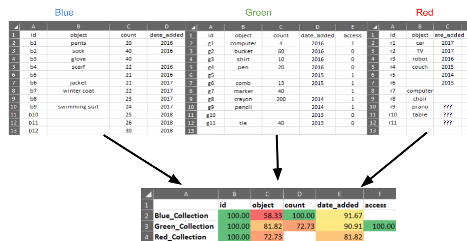

### Excel Heat Maps

##### A Python program for creating Excel percent matrices on how complete your data is.
 
This program works by reading a set of Excel files, putting together a single report on how complete the data fields 
are in each, using conditional formatting in Excel for a data visual. An example is as follows: 

Say you have Excel reports for metadata on three collections: red, green, and blue. Each report has its own metadata, and some
collections are more complete than others: 



The output report tells you the percentage of data that's filled in for each metadata element for each collection. If a metadata
element is missing from a report, the output in the heat map will be a blank cell. Clicking on a cell will reveal the formula that
determines the completion percentage (the ratio of filled in items over total items, e.g., 7/10).
 
How to run it: 

Download the code, install the requirements (`python -m pip install -r requirements.txt`) inside the project directory, and place your
input files in the `files/in` directory. 

A simple example of running the code is as follows: 

```Python3
from ExcelHeatMaps.combiner import ExcelFileCombiner
efc = ExcelFileCombiner() 
efc.get_percent_matrix()
```

The output file should appear in the `files/out` directory.